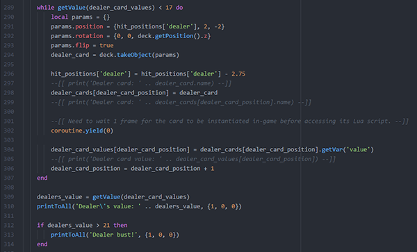
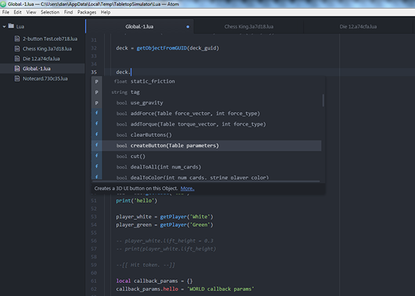
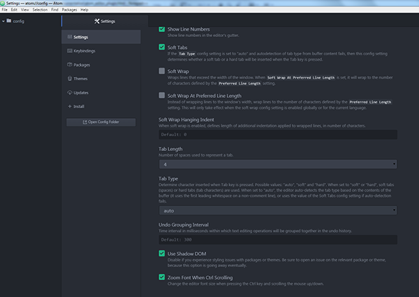

Atom is a free, open source, and cross-platform text editor created by [GitHub](http://www.github.com/):

!!!note ""
	Atom is a text editor that's modern, approachable, yet hackable to the core - a tool you can customize to do anything but also use productively without ever touching a config file.

We created an official plugin for the Atom text editor to make writing Lua scripts for Tabletop Simulator super easy and fun!

This page provides a basic overview of how to install and use the plugin; if you would like a more in-depth explanation of its features and how to install/use it then please see its documentation:

* [Atom Plugin Documentation Home](https://github.com/Berserk-Games/atom-tabletopsimulator-lua/wiki)
	* [Installation Instructions](https://github.com/Berserk-Games/atom-tabletopsimulator-lua/wiki/Installation)
	* [Features](https://github.com/Berserk-Games/atom-tabletopsimulator-lua/wiki/Features)
	* [Commands](https://github.com/Berserk-Games/atom-tabletopsimulator-lua/wiki/Commands)
	* [Settings](https://github.com/Berserk-Games/atom-tabletopsimulator-lua/wiki/Settings)

Our official plugin introduces syntax highlighting, code autocompletion for the Tabletop Simulator Lua API, and functions to interact with the game. The in-game editor will continue to exist for quick access to scripts, but development on it will cease to continue.

Prefer another text editor? Take look at our [External Editor API](http://berserk-games.com/knowledgebase/external-editor-api/) to make your own plugin.

## Features

This is only a summarized list of features Atom offers. Check out a more complete documentation on the plugin specifically in the [plugin wiki](https://github.com/Knils/atom-tabletopsimulator-lua/wiki).

### Syntax Highlighting
All standard Lua syntax is highlighted in multiple colors to help with readability.

### Code Autocompletion
The entire Tabletop Simulator Lua Scripting API (with the exception of the Player class) has been added to the native Atom autocomplete system. Easily see all of the member variables and functions available to you with their parameters, return type, short description, and a link directly to our Knowledge Base with more information for that variable or function. Functions belonging to the Lua standard library classes such as math, coroutine, or os link directly to the official Lua documentation.

### Tabletop Simulator Interactivity
The Atom plugin can directly connect to a running instance of Tabletop Simulator to get all of the existing Lua scripts on Objects and to call Save & Play. Both functions can be called directly from the Packages menu or the right click contextual menu. TTS must be running with the game loaded for these functions to work.

Command | Action Taken
--------|--------
Get Lua Scripts | Downloads all existing scripts in a loaded Tabletop Simulator game with Atom. You will need to call Get Lua Scripts every time you change to a different game in TTS.
Save & Play | Saves all Lua files in Atom, uploads them to a loaded Tabletop Simulator game, and reloads the current game (same as Save & Play in the in-game editor).

> Every time you start up Atom, the cached local `*.lua` files are deleted.

## Installing Atom
Download and install Atom [from the official website](https://atom.io/).

### Installing the Official Plugin
1. Click on File -> Settings
2. Select the Install tab in Settings
3. Type in tabletopsimulator-lua into the search field and press the Enter key or click the Packages button
4. Click the blue Install button for the tabletopsimulator-lua package

## Setting Up Atom

### Tab Width
By default, Tabletop Simulator scripts use a tab width of four spaces. You are not required to adhere to this spacing. By default, Atom has a tab width of two spaces. To optionally make Atom default to a tab width of four spaces:

1. Click on File -> Settings
2. Select the Settings tab in Settings
3. Scroll down to Tab Length
4. Set the Tab Length to 4

### Tables as Pipe Operators
To enable tabs showing up as pipe operators "|" as an indent guide:

1. Click on File -> Settings
2. Select the Settings tab in Settings
3. Scroll down to Show Indent Guide
4. Check Show Indent Guide

##Updating Atom Plugin
The plugin will automatically check for updates when Atom is started. If a new update is found, it will update itself. You will have to manually restart Atom for the new version of the plugin to be loaded. You can check Atom's console if it found an update (ctrl + alt + i).

## Atom Tips

These are just a few basic tips to help get the most out of Atom.

* Print Messages
	* All print() functions automatically send their messages to Atom's console (ctrl + shift + i).
* Error Messages
	* All Lua errors are automatically sent to Atom's console (ctrl + shift + i).
* Quick Save + Play
	* Hitting Ctrl + Shift + S will trigger Save & Play.
